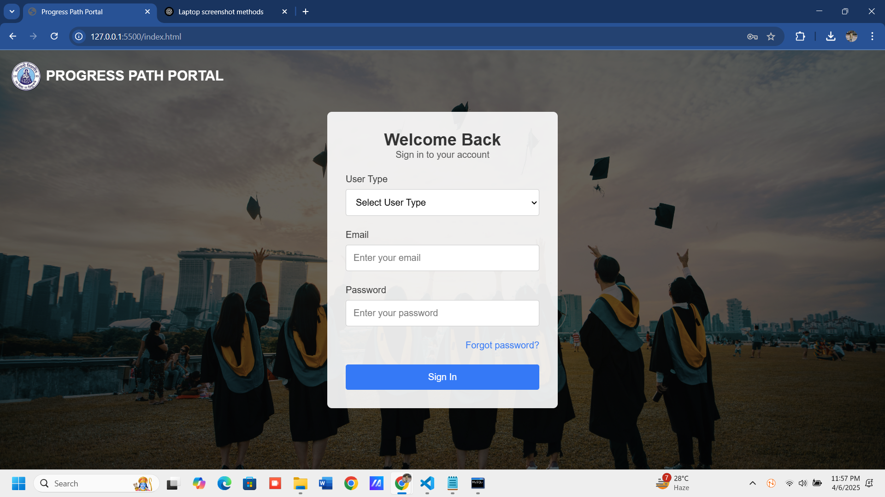
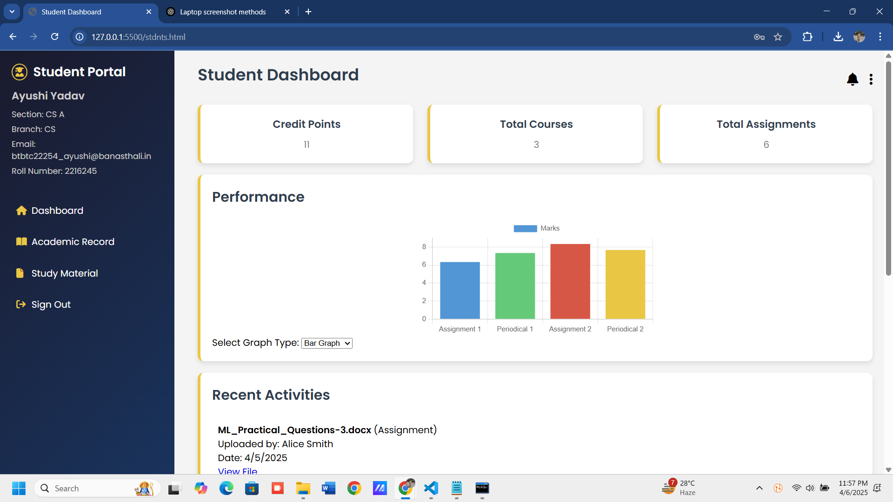
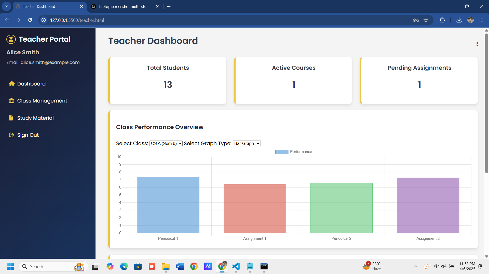

# 🧭 Progress Path – Academic Transparency, Made Simple
A Smart, Intuitive Student-Teacher Portal for managing marks, assignments, study materials, and academic communication in real-time.


## 📋 Table of Contents
- [Overview](#-overview)
- [Key Objectives](#-key-objectives)
- [Features](#-features)
- [Technologies Used](#-technologies-used)
- [API Endpoints](#-api-endpoints)
- [Project Structure](#-project-structure)
- [Installation & Setup](#-installation--setup)
- [Deployment & Maintenance](#-deployment--maintenance)
- [Usage](#-usage)
- [Screenshots & UI/UX](#-screenshots--uiux)
- [Security Highlights](#-security-highlights)
- [Future Enhancements](#-future-enhancements)
- [Contributors](#-contributors)

## 🔍 Overview

Progress Path is a modular web application designed to streamline academic workflows between students and teachers. Built with a responsive UI and secure backend, it empowers students to monitor their continuous assessment progress, while enabling teachers to update marks, assignments, and resources effortlessly.

## 🎯 Key Objectives

- To provide a simple and intuitive portal for academic management.
- To enhance real-time communication between students, teachers, and administration.
- To streamline the workflow for marks, assignments, and study material management.

## ✨ Features

### 🎓 Student Portal
- **View marks** (graphical & tabular view)
- **Upload assignments**
- **Download study material**
- **Access faculty contacts, syllabus**

### 👩‍🏫 Teacher Portal
- **Upload marks**
- **Share study material files and assignments**
- **Make announcements to class**
- **View uploaded assignments**

### 🧑‍💼 Admin Portal
- **Manage student and teacher accounts**
- **Assign courses and sections**
- **View dashboard statistics and performance data**
- **Control system configurations** (e.g., class schedules, course creation)

## 🛠️ Technologies Used

| Component       | Technology                            |
| --------------- | ------------------------------------- |
| Frontend        | HTML, CSS, JavaScript                 |
| Backend         | Node.js, Express.js                   |
| Database        | MySQL                                 |
| UI Library      | Bootstrap                             |
| Auth            | JWT, Google OAuth 2.0                 |
| File Handling   | Local storage (potential Cloudinary or AWS S3) |
| Email           | Nodemailer (SMTP)                     |
| API Style       | RESTful (GET/POST)                    |
| Deployment      | Oracle Cloud VM                       |

## 📡 API Endpoints

### 🔐 Authentication

| Method | Endpoint            | Description                              |
| ------ | ------------------- | ---------------------------------------- |
| POST   | `/login`            | Log in user (student/teacher/admin)      |
| GET    | `/logout`           | Logout current session                   |
| POST   | `/forget-password`  | Send password to registered email        |

### 🎓 Student APIs

| Method | Endpoint                             | Description                                        |
| ------ | ------------------------------------ | -------------------------------------------------- |
| GET    | `/student`                         | Get student profile, credit points, performance graph |
| GET    | `/student/notifications`           | Get student notifications                          |
| POST   | `/student/change-password`         | Student password change                           |
| GET    | `/acad`                            | Student academic record (courses + marks)         |
| GET    | `/studentstudy`                    | Get recent and all study materials & assignments  |
| POST   | `/uploadStudentAssignment`         | Upload an assignment as a student                 |

### 👨‍🏫 Teacher APIs

| Method | Endpoint                                  | Description                                               |
| ------ | ----------------------------------------- | --------------------------------------------------------- |
| GET    | `/teacher`                              | Get teacher dashboard info                                |
| POST   | `/teacher/change-password`              | Teacher password change                                   |
| GET    | `/teacherstudy`                         | Get teacher’s uploaded study materials and assignments    |
| GET    | `/teacherclasses`                       | Get classes + students count assigned to the teacher      |
| GET    | `/teacher-lecture/:id`                    | Detailed teacher lecture and class info                   |
| POST   | `/addClass`                             | Assign class to a teacher                                 |
| POST   | `/uploadTeacherSubject`                 | Bulk upload class assignments (via Excel)                 |
| DELETE | `/deletelectureclass`                   | Delete a teacher's assigned class                         |

### 📝 Marks & Assignment Evaluation

| Method | Endpoint                                                               | Description                          |
| ------ | ---------------------------------------------------------------------- | ------------------------------------ |
| GET    | `/students/:teacher_id/:subject_id/:section_name/:semester`             | Fetch student list with marks        |
| POST   | `/savemarks`                                                           | Save or update student marks         |
| GET    | `/studentSubmissions`                                                  | Get student assignment submissions   |

### 📘 Study Material & Assignment Upload

| Method | Endpoint                        | Description                              |
| ------ | ------------------------------- | ---------------------------------------- |
| POST   | `/upload-study-material`         | Upload study material as teacher          |
| POST   | `/upload-assignment`            | Upload assignment as teacher               |

### 🧑‍💼 Admin Dashboard

| Method | Endpoint                 | Description                                 |
| ------ | ------------------------ | ------------------------------------------- |
| GET    | `/admindashboard`        | Get admin dashboard stats                   |
| GET    | `/getDropdownData`       | Get course/year/section options             |
| GET    | `/getGraphData`          | Get graph data for selected class           |
| GET    | `/getStudents`           | Get student performance list                |

### 📚 Subject Management

| Method | Endpoint                          | Description                              |
| ------ | --------------------------------- | ---------------------------------------- |
| GET    | `/subjects`                       | Get all subjects                         |
| POST   | `/addSubject`                     | Add new subject                          |
| DELETE | `/deleteSubject/:subject_id`       | Delete a subject                         |
| GET    | `/getSubjectTeachers`             | Get teachers teaching a subject          |

### 👨‍🏫 Teacher Management

| Method | Endpoint                      | Description                                   |
| ------ | ----------------------------- | --------------------------------------------- |
| GET    | `/teachers`                   | Get all teachers                              |
| POST   | `/addTeacher`                 | Add new teacher                               |
| POST   | `/uploadTeachers`             | Bulk upload teachers via Excel                |
| DELETE | `/deleteTeacher/:id`          | Delete a teacher                              |

### 🏫 Course & Section Management

| Method | Endpoint                 | Description                                         |
| ------ | ------------------------ | --------------------------------------------------- |
| GET    | `/courses`               | Get distinct courses                                |
| POST   | `/addCourse`             | Add a new course + section                          |
| DELETE | `/deleteCourse/:name`      | Delete a course                                   |
| GET    | `/students`              | Get students by course + year                        |

## 📂 Project Structure

progress-path/  
├── client/ # Frontend HTML, CSS, and images  
│   ├── assets/  
│   │   └── images/ # Project images (e.g., logos, photos)  
│   ├── styles/ # All CSS files  
│   └── pages/ # All HTML pages  
├── server/ # Backend logic  
│   ├── server.js # Main server file  
│   └── Creds/ # Credentials folder (e.g., email)  
├── node_modules/ # Installed dependencies  
├── package.json # Project metadata and dependencies  
├── package-lock.json # Dependency versions  
├── .env # Environment variables (if used)  
├── README.md # Project description  
└── demo.mp4 # Original demo video file (now replaced)

... (truncated for brevity)

---
## ⚙️ Installation & Setup

### 📦 Prerequisites
Make sure the following tools are installed on your Oracle VM:

- [Node.js (LTS)](https://nodejs.org/)
- [MySQL Server](https://dev.mysql.com/downloads/mysql/)
- [Git (optional)](https://git-scm.com/)
- [Postman](https://www.postman.com/) – for API testing

---


### 🗄️ Step 1: Set Up the MySQL Database

1. Open **MySQL Workbench** or the **Command Line**.
2. Run the following SQL command to create the database:

```sql
CREATE DATABASE student_portal;

(Optional: If you have an SQL schema, import it to populate your database.)

### 📝 Step 2: Create `.env` File

In the root folder (`C:\\StudentPortal\\`), create a `.env` file with the following configuration:

```env
PORT=5000
DB_HOST=localhost
DB_USER=root
DB_PASSWORD=your_mysql_password
DB_NAME=student_portal
JWT_SECRET=yourSecretKey
EMAIL_USER=your_email@example.com
EMAIL_PASS=your_email_password
```

### 📥 Step 3: Install Backend Dependencies

1. Open **Command Prompt** on your system.
2. Navigate to the server folder:

   ```bash
   cd C:\StudentPortal\server
    npm install express mysql dotenv body-parser cors nodemailer multer

### ▶️ Step 4: Start the Backend Server

  1. In the same **Command Prompt** terminal, run the following command to start the backend server:

   ```bash
   node server.js
    The server will start at:
    http://localhost:5000/
    
### 🌐 Step 5: Open the Frontend

1. Navigate to the frontend pages in **File Explorer**:

   - `C:\\StudentPortal\\client\\pages\\student.html`
   - `C:\\StudentPortal\\client\\pages\\teacher.html`

2. Alternatively, you can open these files directly in your browser by typing the path in the browser's address bar or by double-clicking the `.html` files.

---
## 🌐 Deployment & Maintenance

### 📦 Deployment (Oracle VM - Windows)

#### 1. Transfer Project Files

- Copy the complete project folder (`StudentPortal/`) to your **Oracle VM** (via RDP, FTP, or shared folder).

#### 2. Install Dependencies

- Ensure that **Node.js**, **MySQL**, and **npm** are installed on your VM.
  
- Once installed, run the following commands to install the required dependencies:

   ```bash
   cd C:\\StudentPortal\\server
   npm install
#### 3. Start MySQL Server

1. Open **MySQL Workbench** or start the **MySQL service** from the **Services** panel in Windows.
2. Ensure that the **student_portal** database exists and is accessible. If you haven't created the database yet, refer to **Step 1: Set Up the MySQL Database** to create it.

#### 4. Set Environment Variables

1. Verify that the `.env` file exists in the root of your project directory (`C:\\StudentPortal\\`).
2. Ensure that the `.env` file contains valid credentials for the following:
   - **Database**: Database credentials such as `DB_HOST`, `DB_USER`, `DB_PASSWORD`, and `DB_NAME`.
   - **Email Configuration**: Ensure that the `EMAIL_USER` and `EMAIL_PASS` are set correctly for your email account used for sending emails.
   - **JWT Secret**: The `JWT_SECRET` variable should contain a secure, random string used to sign JSON Web Tokens.
#### 5. Run Backend

1. In the terminal, navigate to your project directory and run the following command to start the backend server:

   ```bash
   node server.js
#### 6. Access the App

- **Frontend**: Open the `.html` files from `client/pages/` in your browser:
   - `C:\\StudentPortal\\client\\pages\\student.html`
   - `C:\\StudentPortal\\client\\pages\\teacher.html`

- **Backend API**: The backend API will be accessible at:

---

### 🔧 Maintenance Guidelines

| Task                        | Frequency        | Tool/Notes                                   |
|-----------------------------|------------------|----------------------------------------------|
| 🔁 **Restart Node Server**   | As needed        | Use `pm2 restart server` or restart manually. |
| 🧪 **Test API Endpoints**    | After updates    | Use **Postman** to test API endpoints.       |
| 💾 **Database Backup**       | Daily/Weekly     | Use **MySQL Workbench** or a custom script for backups. |
| 🧼 **Clear Uploaded Files**  | Monthly          | Clean up manually or set up a cleanup script. |
| 🔒 **Update Dependencies**   | Bi-monthly       | Run `npm outdated` and `npm update` to update outdated dependencies. |
| 🔍 **Log & Error Monitoring**| Continuous       | Use `console.log()` or integrate with tools like **Winston** or **Sentry** for error monitoring. |


---


## 🧑‍💻 Usage

### For Students
- Login/Register to access your dashboard.
- View Marks, Attendance, Timetable & Faculty Info.
- Download Study Materials and Upload Assignments under Courses.

### For Teachers
- Login to manage your dashboard.
- Upload Marks, Attendance, Study Materials.
- Make Announcements for students.

### For Admins
- Manage Users, Courses & Sections.
- View dashboards with academic data and system stats.

> **Note**: All actions update in real-time.  
> **Supported file uploads**: PDF, DOCX, PPT.

---

## 📸 Screenshots & UI/UX

Below are demo screenshots showcasing key aspects of Progress Path.  
Replace the image file names with your actual screenshots.

<div align="center"> 
   
  <br> 
   
   
</div>

---

## 🔒 Security Highlights
- Role-Based Access Control (Student/Teacher/Admin)
- Data encryption (HTTPS, hashed passwords)
- Session timeout after inactivity
- Auto backup + recovery system

---

## 🧠 Future Enhancements
- Scalable over other departments
- AI-based performance insights
- Attendance tracking
- Student-parent portal
- Dark mode support

---

## 👥 Contributors
- **Ayushi Yadav**  
- **Kritika Bhati**  
- **Ruchi Shaktawat**

**Contact 📞**:  
ruchishaktawat5@gmail.com | ayushipramodsingh@gmail.com | kritikabhati24@gmail.com
